# ReactJS

## 📑 Table of Contents

### Part 1: Foundation (Understanding the Concepts)
- [Introduction to React](#introduction-to-react)
- [The Internal Engine](#️-the-internal-engine) — Virtual DOM, Fiber, Reconciliation
- [React Version Comparison](#-react-version-comparison) — React 17 vs 18 vs 19
- [JSX](#jsx) — Rules of JSX
- [Components](#components)
- [Props](#props) — Passing, Destructuring, children, Spreading, PropTypes
- [Fragments](#fragments)
- [Keeping Components Pure](#-keeping-components-pure)
- [Conditional Rendering](#conditional-rendering)
- [Lists & Keys](#lists--keys)

### Part 2: Core (Basic React)
- [Functional Components (In Depth)](#functional-components-in-depth)
- [Event Handling](#event-handling) — Bubbling & Propagation
- [Hooks Overview & Rules](#-hooks)
- [useState](#-usestate)
- [Forms](#forms) — [Controlled](#-controlled-components) vs [Uncontrolled](#-uncontrolled-components)
- [Props vs State vs Ref](#props-vs-state-vs-ref)
- [State as a Snapshot](#state-as-a-snapshot)
- [Queueing State Updates](#queueing-state-updates)
- [Forms of State Update](#forms-of-state-update)
- [State Immutability](#state-immutability) — Objects & Arrays
- [useEffect](#-useeffect)
- [useLayoutEffect](#uselayouteffect)
- [Derived State](#derived-state)
- [Lifting State Up](#lifting-state-up)
- [Prop Drilling](#prop-drilling)
- [Preserving & Resetting State](#preserving--resetting-state)

### Part 3: Intermediate
- [useRef & Refs](#refs) — Creation, Forwarding (React 18 & 19)
- [useReducer](#-usereducer) — [useState vs useReducer](#usestate-vs-usereducer)
- [Context API](#context-api)
- [Custom Hooks](#-custom-hooks)
- [Component Composition](#-component-composition) — Containment, Specialization, Multi-Slot
- [Error Boundaries](#error-boundaries) — Error Handling Outside Boundaries
- [Portals](#portals)
- [Development Utilities](#️-development-utilities) — Strict Mode & Profiler
- [React Compiler](#react-compiler-react-forget)

### Part 4: Advanced
- [useMemo](#-usememo) | [useCallback](#-usecallback) | [React.memo](#️-reactmemo)
- [Performance Optimization](#-performance-optimization) — Code Splitting
- [Suspense & React.lazy](#-suspense--reactlazy)
- [Transitions (Concurrent React)](#-transitions-concurrent-react) — useTransition, startTransition
- [useImperativeHandle](#-useimperativehandle) | [useId](#-useid) | [useDeferredValue](#-usedeferredvalue)
- [useSyncExternalStore](#-usesyncexternalstore) | [useInsertionEffect](#-useinsertioneffect) | [useDebugValue](#-usedebugvalue)
- [Component Patterns](#️-component-patterns--apis) — Container/Presentational, HOCs, Render Props, Compound Components
- [Proxy Rendering](#-proxy-rendering)
- [Hook Composition](#hook-composition)
- [Class Components](#class-components-in-depth) — [Lifecycle Methods](#lifecycle-methods)

### Part 5: Ecosystem & Beyond
- [Routing](#️-routing)
- [State Management](#-state-management) — Redux, Zustand, Jotai
- [Data Fetching](#-data-fetching) — TanStack Query, SWR
- [Rendering Strategies](#️-rendering-strategies) — CSR, SSR, SSG, ISR, Streaming SSR
- [Server Components](#server-components-rsc) | [Client Components](#client-components-use-client) | [Server Actions](#server-actions-use-server)
- [Hydration](#hydration) — Selective Hydration
- [React 19 Features](#-react-19-features) — use(), Actions, useOptimistic, Document Metadata
- [TypeScript in React](#typescript-in-react)
- [Styling Approaches](#-styling-approaches)
- [Testing](#-testing)
- [Accessibility (a11y)](#accessibility-a11y)
- [ESLint with eslint-plugin-react-hooks](#eslint-with-eslint-plugin-react-hooks) | [React DevTools](#react-devtools)
- [React Utility APIs](#-react-utility-apis) — React.Children, cloneElement, isValidElement, flushSync, act()
- [Memory Leak Prevention](#-memory-leak-prevention)
- [Common Mistakes & Gotchas](#️-common-mistakes--gotchas)
- [All Hooks at a Glance](#️-all-hooks-at-a-glance)

---

# Part 1: Foundation (Understanding the Concepts)

## Introduction to React

* React is an open-source JavaScript library for building UIs, developed by Meta and maintained by the open-source community.

  ```mermaid
  flowchart TD
    A(((CORE PILLARS)))
    A -..-> B[🧱 Declarative] -...-> B1([Describe WHAT to display, not HOW to update])
    A -..-> C[🧩 Component-Based] -...-> C1([Reusable UI components managing their own state])
    A -..-> D[🌐 Virtual DOM] -...-> D1([Efficient rendering by minimizing direct DOM updates])
    A -..-> E[⚡ SPA Model] -...-> E1([Dynamic content updates without page reloads])
    A -..-> F[📱 Multi-Platform] -...-> F1([Web, Mobile via React Native, and more])
    A -..-> G[➡️ One-Way Data Flow] -...-> G1([Props flow DOWN / Events flow UP])
    A -..-> H[📦 Batching] -...-> H1([Groups multiple state updates into one re-render])
  ```

  ```mermaid
  flowchart TD
    A(((KEY BENEFITS)))
    A -.-> B[✅ Predictable] -.-> B1([DOM changes based on state])
    A -.-> C[📖 Readable] -.-> C1([Easier to understand & maintain])
    A -.-> D[🐛 Debuggable] -.-> D1([Trace state & UI updates])
    A -.-> E[📈 Scalable] -.-> E1([Robust for complex UIs])
  ```

## ⚙️ The Internal Engine
React uses a sophisticated rendering process to keep your UI in sync with your data efficiently.

#### 1. Virtual DOM & Reconciliation
* **Virtual DOM**: A lightweight, in-memory copy of the real DOM.
* **Diffing**: When a component re-renders, React creates a new V-DOM and compares it with the previous V-DOM to calculate the **minimum number of updates needed**.
* **Batching**: Groups multiple state updates together to perform a single DOM update, **optimizing performance**.
* **Reconciliation**: The process of syncing the V-DOM with the real DOM.
    * Uses a heuristic **O(n) algorithm** to keep the UI in sync with data without slow O(n³) tree diffs.
    * Result: Reduces direct DOM manipulation and only updates the changed parts.

#### 2. Fiber & Concurrent Rendering (React 18+)
* **Fiber Architecture**: React's core engine that enables **Incremental Rendering** (splitting work into chunks).
* **Concurrent Rendering**: Allows React to pause a long-running render to handle a high-priority event (like a user click).
* **Transitions**: Mark certain updates as "non-urgent" to keep the UI responsive during heavy computations.

  ```mermaid
  graph LR
      Start([State Change]) --> VDOM[Create New V-DOM]
      VDOM --> Diff[Diffing vs Old V-DOM]
      Diff --> Reconcile[Reconciliation]
      Reconcile --> Batch[Batch Updates]
      Batch --> RealDOM[Update Real DOM]
  ```

## 🔄 React Version Comparison

| Feature | React 17 & Below | React 18 | React 19 |
| :--- | :--- | :--- | :--- |
| **Library Import** | `react-dom` | `react-dom/client` | `react-dom/client` |
| **Root API** | `render(<App />, el)` | `createRoot(el).render(<App />)` | `createRoot(el).render(<App />)` |
| **Rendering Model** | Synchronous only | Concurrent via `createRoot` | Concurrent (default) |
| **Auto Batching** | ❌ (Only Event Handlers) | ✅ With `createRoot` | ✅ Always |
| **Suspense** | Limited (Code Splitting) | Full (Splitting & Streaming) | Full + `use()` hook for promises |
| **Hydration** | `hydrate()` | `hydrateRoot()` | `hydrateRoot()` |
| **Unmount API** | `unmountComponentAtNode()` | `root.unmount()` | `root.unmount()` |
| **UI Responsiveness** | Render-blocking | Non-blocking | Non-blocking |
| **Ref Forwarding** | `forwardRef` required | `forwardRef` required | `ref` as a regular prop ✨ |
| **Compiler** | N/A | N/A | React Compiler (auto-memoization) |
| **Actions** | N/A | N/A | `useActionState`, `useFormStatus`, `useOptimistic` |
| **Metadata** | Manual (react-helmet etc.) | Manual | Native `<title>`, `<meta>`, `<link>` |

## JSX
* JSX is a syntax extension for JavaScript that looks like HTML.
* It is syntactic sugar for `React.createElement(type, props, children)` calls.
* JSX allows you to write UI by combining JavaScript and markup in the same file.
* It gets transformed into JavaScript during the build process (e.g., by Babel).
* It makes creating and composing React components easier and more readable.

  **Older Way**
  ```jsx
  React.createElement("div", null, "Hi");
  React.createElement("div", { className: "flex" }, "Hi");
  React.createElement("div", null, React.createElement("span", null, "Hi"));
  ```

  **Newer Way**
  ```jsx
  const element = <h1 className="flex">Hello React!</h1>;
  ```

### 🧱 Rules of JSX (Stricter than HTML)

```mermaid
flowchart TD
  A(((JSX RULES)))

  A -.-> B[🧱 Single Root] -.-> B1([JS functions can only return a single value])
  A -.-> E[🎁 Wrapping] -.-> E1([Use <>...</> or <Fragment>...</Fragment> to group])
  A -.-> C[🏷️ Close Tags] -.-> C1([Self-closing required: img / br / hr /])
  A -.-> D[🔡 CamelCase] -.-> D1([JS Properties: className, onClick, htmlFor])
```


  ```jsx
  // Valid JSX with Fragment
  const MyComponent = () => (
    <>
      <h1>Title</h1>
      <p>Content</p>
      
    </>
  );
  ```

## Components
* **Building Blocks**: React apps are built by composing small, isolated pieces called components.
* **Capitalization**: Names *must* start with a Capital letter (e.g., `<Header />` vs `<div />`).
* **Mental Model**: Think of them as custom HTML tags that come with their own logic and styles.
* **Nesting**: Components can contain other components, forming a **Component Tree**.
  ```jsx
  const Greeting = (props) => <h1>Hello, {props.name}!</h1>;
  ```

## Props
* **What**: Short for "properties" — the way data flows from a **parent** component to a **child** component.
* **Read-Only**: Props are **immutable** inside the child. A component must never modify its own props.
* **Any Value**: Props can be strings, numbers, booleans, objects, arrays, functions, or even other React elements.
* **Unidirectional**: Data flows **one way** — parent → child. To communicate upward, parents pass **callback functions** as props.

### 📥 Passing & Receiving Props
  ```jsx
  // Parent passes props
  const App = () => <UserCard name="Raju" age={25} isAdmin />;

  // Child receives props
  const UserCard = (props) => <h2>{props.name}</h2>;
  ```

### 🔓 Destructuring Props
* **Best Practice**: Destructure in the function signature for cleaner, more readable code.
* **Default Values**: Assign defaults directly in the destructuring pattern.

  ```jsx
  // ✅ Destructured with defaults
  const App = () => <UserCard name="Raju" age={25} isAdmin />;

  const UserCard = ({ name, age, isAdmin = false }) =><h2> {isAdmin ? "Admin" : "User"}</h2>;
  ```

### 🔄 Prop Spreading
* **Pattern**: Use the spread operator `{...props}` to forward all props to a child element or component.
* **Caution**: Can make it harder to track which props are passed — use deliberately.

  ```jsx
  // Forward all props to the underlying <button>
  const App = () => <UserCard name="Raju" age={25} isAdmin />;

  const UserCard = ({ age, ...rest }) =><h2>{rest.name}</h2>;
  ```

### 👶 The `children` Prop
* **Special Prop**: Anything placed **between** a component's opening and closing tags is passed as `props.children`.
* **Use Case**: Building wrapper/layout components that don't know their content ahead of time.

  ```jsx
  const App = () => (
    <UserCard>
      <p>This is the user card.</p>
    </UserCard>
  );

  const UserCard = ({ name, children }) => <>
    <h2>{name}</h2>
    {children}
  </>;
  ```

### 🛡️ PropTypes (Runtime Validation)
* **Purpose**: Runtime type-checking for props during development. Logs warnings in the console if a prop has the wrong type.
* **Modern Alternative**: **TypeScript** provides compile-time type safety and is preferred in modern projects.

  ```jsx
  import PropTypes from "prop-types";

  const UserCard = ({ name, age }) => <p>{name} — {age}</p>

  UserCard.propTypes = {
    name: PropTypes.string.isRequired,
    age: PropTypes.number,
  };

  UserCard.defaultProps = {
    age: 18,
  };
  ```

| Validation | PropTypes | TypeScript |
| :--- | :--- | :--- |
| **When** | Runtime (dev only) | Compile-time |
| **Errors** | Console warnings | Build errors |
| **Adoption** | Legacy / smaller projects | Modern standard |

## Fragments
* **No DOM Overhead**: They group elements without adding a wrapper `<div>` or `<span>`, so they have **no effect on style, layout, or accessibility**.
* **Keyed Fragments**: You can pass the `key` prop to a Fragment during reconciliation (e.g., in a list).
    * *Note:* You must use the `<Fragment>` syntax to pass keys; the shorthand `<>...</>` does not support props.
* **Syntax**: `<Fragment>...</Fragment>` or shorthand `<>...</>`
    ```jsx
    // Keyed Fragment in a list
    {items.map(item => (
      <Fragment key={item.id}>
        <dt>{item.term}</dt>
        <dd>{item.description}</dd>
      </Fragment>
    ))}
    ```

## 🧼 Keeping Components Pure
* **Pure Function**: Given the same inputs, always returns the same output and has **no side effects** (doesn't modify variables outside its scope).
* **React's Expectation**: Components should be pure during rendering — same props & state should always produce the same JSX.
* **What to Avoid in Render**:
    * Mutating variables declared before the component was called.
    * Mutating props or global variables.
    * Making network requests or setting timers directly in the render body.
* **Side Effects Belong**: In event handlers or `useEffect` — not in the render logic itself.
* **Local Mutation is Fine**: Mutating variables created *during* the same render is perfectly okay — it's "local mutation."

  ```jsx
  // ❌ Impure — mutates an external variable during render
  let guest = 0;
  const BadCard = () => {
    guest++;  // Side effect during render!
    return <h2>Guest #{guest}</h2>;
  };

  // ✅ Pure — same props always produce the same output
  const GoodCard = ({ guestNumber }) => <h2>Guest #{guestNumber}</h2>;

  // ✅ Local mutation is fine
  const List = () => {
    const items = [];                         // Created during this render
    for (let i = 0; i < 5; i++) {
      items.push(<li key={i}>Item {i}</li>);  // Mutating a local variable
    }
    return <ul>{items}</ul>;
  };
  ```

## Conditional Rendering
* **Common patterns**: `if/else`, ternary (`? :`), logical AND (`&&`).
* **Logical OR (`||`)**: Used for fallback content (e.g., `{name || "Stranger"}`).
* **The Case of 0**: Be careful with `count && <Component />`. If count is `0`, React will render `0` on the screen. Use `{count > 0 && <Component />}` instead.
* **Return `null`**: To hide a component completely.

    ```jsx
    // Ternary
    {isLoggedIn ? <Dashboard /> : <Login />}

    // Logical AND
    {hasNotifications && <NotificationBadge />}
    ```

## Lists & Keys
* **Array.map()**: The standard way to render lists of elements dynamically in React.
* **Tracking Changes**: Each list item must have a unique `key` prop. This helps React track which items have changed, been added, or been removed.
* **Efficiency**: Keys enable efficient updates and reordering without re-rendering the entire list.
* **Sibling Uniqueness**: Keys only need to be **unique among siblings**. It is perfectly okay to use the same keys in different arrays/lists on the same page.
* **Stability**: Keys **must be stable and unique** (like IDs). They should not change between renders.
* **Bad Practice**: **Never generate keys while rendering** (e.g., `key={Math.random()}`). This defeats their purpose, causes React to lose the component's identity on every render, and leads to poor performance or lost input focus.
* **Index Warning**: Avoid using the array index as a key if the list can change order, be filtered, or have items added/removed.

    ```jsx
    {fruits.map(fruit => <p key={fruit.id}>{fruit.name}</p>)}
    ```

---

# Part 2: Core (Basic React)

## Functional Components (In Depth)
* **Definition**: Standard JS functions that receive `props` and return a React element (JSX).
* **Pure Nature**: They should ideally behave like "Pure Functions"—the same props should always render the same UI.
* **Modern Standard**: With the introduction of **Hooks**, functional components can now handle everything classes could (state, lifecycle) with less code.
* **Conciseness**: No `this` keyword, no complex bindings, and better performance (minification).
* **Props Destructuring**: Best practice to destructure props in the function signature for cleaner, more readable code.
* **Return Patterns**:
    * **Implicit Return**: `const Comp = () => <h1>Hi</h1>` (Single expression, no extra logic).
    * **Explicit Return**: `const Comp = () => { return <h1>Hi</h1> }` (Required if you have logic before returning).

  ```jsx
  const UserCard = ({ name, age }) => (
    <div>
      <h2>{name}</h2>
      <p>Age: {age}</p>
    </div>
  );
  // Usage:
  <UserCard name="Raju" age={25} />
  ```

## Event Handling
* React events are named using camelCase (e.g., `onClick`, `onChange`, `onSubmit`).
* Event handlers are passed as functions, not strings.
* **SyntheticEvent**: A cross-browser wrapper around native events to ensure consistent behavior across all browsers.
* Use `e.preventDefault()` to prevent default browser behavior.
* Use `e.stopPropagation()` to stop event bubbling.

  ```jsx
  const Form = () => {
    const handleSubmit = (e) => {
      e.preventDefault();
      console.log("Form submitted!");
    };

    return (
      <form onSubmit={handleSubmit}>
        <button type="submit">Submit</button>
      </form>
    );
  };
  ```

## 🪝 Hooks

* **What**: Functions that let you "hook into" React's state and lifecycle from functional components.
* **Rules of Hooks**:
    1. **Only call at the top level** — never inside loops, conditions, or nested functions.
    2. **Only call from React functions** — functional components or custom hooks (not regular JS functions).
* **Why the Rules?**: React relies on the **call order** of hooks being the same on every render to correctly associate state with the right hook call.

  ```mermaid
  flowchart TD
    A(((HOOKS)))

    A -.-> S[📦 State & Effects]
    S -.-> S1([useState, useReducer])
    S -.-> S2([useEffect, useLayoutEffect, useInsertionEffect])

    A -.-> C[🔗 Context & Refs]
    C -.-> C1([useContext, useRef, useImperativeHandle])

    A -.-> P[🧠 Performance]
    P -.-> P1([useMemo, useCallback])
    P -.-> P2([useTransition, useDeferredValue])

    A -.-> U[🔧 Utilities]
    U -.-> U1([useId, useDebugValue, useSyncExternalStore])

    A -.-> R[🆕 React 19]
    R -.-> R1([use, useOptimistic, useActionState, useFormStatus])
  ```

## 📦 useState
* **Purpose**: Adds reactive state to a functional component. Returns a `[value, setter]` tuple.
* **Signature**: `const [state, setState] = useState(initialValue);`
* **Lazy Initialization**: Pass a **function** to avoid re-running expensive initial computations on every render.
* **Setter Behavior**: Calling `setState` schedules a re-render with the new value. It does **not** update the variable immediately (state is a snapshot).
* **Functional Updates**: When the next state depends on the previous, use the updater form `setState(prev => ...)`.

  ```jsx
  // Basic usage
  const [count, setCount] = useState(0);

  // Lazy initialization — the function runs only on the first render
  const [data, setData] = useState(() => {
    return JSON.parse(localStorage.getItem("data")) ?? [];
  });

  // Updating state
  setCount(5);                    // Direct value
  setCount(prev => prev + 1);    // Updater function (use when depending on previous state)
  ```

> **Deep Dive**: See [State as a Snapshot](#state-as-a-snapshot), [Queueing State Updates](#queueing-state-updates), and [State Immutability](#state-immutability) for advanced state behavior.

## Forms
* Forms in React can be controlled or uncontrolled.
* Handle form submission with `onSubmit` and prevent default behavior.
* Manage form data using state for controlled components.

## Controlled vs Uncontrolled Components

| Feature | Controlled | Uncontrolled |
| :--- | :--- | :--- |
| **Data Source** | React State | The DOM (Ref) |
| **Source of Truth** | Component State | Native DOM Elements |
| **Data Handling** | Real-time (every keypress) | On-demand (e.g., on Submit) |
| **Complexity** | More boilerplate code | Less code / Simpler |

### 🎮 Controlled Components
* Form elements whose value is controlled by React state.
* Every state change triggers a re-render, keeping the input in sync.
* Gives you full control for real-time validation and conditional UI.

  ```jsx
  const ControlledInput = () => {
    const [value, setValue] = useState("");

    return <input value={value} onChange={(e) => setValue(e.target.value)} />;
  };
  ```

### 🔓 Uncontrolled Components
* Form elements that manage their own state internally via the DOM.
* Use `useRef` to access the current value when needed.
* **Initial Value**: Use `defaultValue` instead of `value` to set an initial state without controlling it.

  ```jsx
  const UncontrolledInput = () => {
    const inputRef = useRef(null);

    return <input ref={inputRef} defaultValue="Raju" />
  };
  ```

## Props vs State vs Ref
| Feature | Props | State | Ref |
| :--- | :--- | :--- | :--- |
| **Source** | Received from Parent | Internal to Component | Internal (DOM/Value) |
| **Changeable?** | ❌ No (Read-only) | ✅ Yes (via setter) | ✅ Yes (Directly) |
| **Ownership** | Parent | Component | Component |
| **Re-render?** | ✅ Yes | ✅ Yes | ❌ No |
| **Updates** | Synchronous | Asynchronous & Batched | Synchronous |
| **Analogy** | Like function arguments | Like local variables | Like an instance variable |
| **Passing Down** | ✅ Yes (to children) | ✅ Indirectly (via props) | ✅ Via `forwardRef` / ref prop (React 19) |

## State as a Snapshot
* **Core Idea**: State is a **snapshot in time**, not a live variable. When React calls your component, it gives you a snapshot of the state for *that particular render*.
* **Implication**: Reading state right after calling `setState` still gives you the **old value** — the new value is only available on the next render.
* **Closures**: Event handlers "close over" the state from the render in which they were created. Even async code inside a handler sees the state from *when the handler was defined*.

  ```jsx
  const Counter = () => {
    const [count, setCount] = useState(0);

    const handleClick = () => {
      setCount(count + 1);
      console.log(count); // Still 0 on first click — it's a snapshot!
    };

    return <button onClick={handleClick}>Count: {count}</button>;
  };
  ```

## Queueing State Updates
* **Batching**: React **queues** all state updates and processes them together before the next render. Multiple `setState` calls in the same event handler result in a single re-render.
* **Updater Functions**: When you call `setState` multiple times and each depends on the previous value, use the **functional form** `(prev) => newValue` to ensure each update builds on the latest queued value.

  ```jsx
  const handleClick = () => {
    // ❌ Both read the same snapshot — count only increments by 1
    setCount(count + 1);
    setCount(count + 1);

    // ✅ Each updater receives the latest queued value — increments by 3
    setCount(prev => prev + 1);
    setCount(prev => prev + 1);
    setCount(prev => prev + 1);
  };
  ```

## Forms of State Update

| Feature | Class Component (`setState`) | Functional Component (`useState`) |
| :--- | :--- | :--- |
| **Merging Type** | ✅ **Shallow Merge**: Automatically merges current state with new keys. | ❌ **Replacement**: Overwrites the entire state with the new value. |
| **Callback** | ✅ Supported as 2nd argument: `this.setState(s, cb)` | ❌ Not supported. Use `useEffect` instead. |
| **Prev State** | Access via `(prevState) => { ... }` | Access via `(prev) => { ... }` |

### 🛠️ Key Update Patterns

1. **Object Form (Simple Updates)**:
   - *Class:* `this.setState({ count: 1 });`
   - *Function:* `setCount(1);`

2. **Functional Form (Dependent Updates)**:
   - **Rule**: Always use this if the new state depends on the old state (e.g., toggles, counters).
   - *Class:* `this.setState((prev) => ({ count: prev.count + 1 }));`
   - *Function:* `setCount(prev => prev + 1);`

3. **Reacting to Completion**:
   - *Class:* `this.setState({ x: 1 }, () => console.log("Done!", this.state.x));`
   - *Function:*
    ```jsx
    useEffect(() => {
      console.log("Count updated!", count);
    }, [count]);
    ```

## State Immutability
* **Rule**: Never mutate state directly. Always create a **new** object or array and pass it to the setter.
* **Why**: React uses **reference equality** (`===`) to detect changes. If you mutate the same object, the reference doesn't change and React won't re-render.

### 🔄 Updating Objects
  ```jsx
  const [user, setUser] = useState({ name: "Raju", age: 25 });

  // ❌ Mutation — won't trigger re-render
  user.name = "Ansh";
  setUser(user);

  // ✅ New object via spread
  setUser({ ...user, name: "Ansh" });

  // ✅ Nested object — spread at every level
  const [form, setForm] = useState({ address: { city: "Delhi", zip: "110001" } });
  setForm({ ...form, address: { ...form.address, city: "Mumbai" } });
  ```

### 🔄 Updating Arrays
| Operation | Avoid (Mutates) | Prefer (Returns new array) |
| :--- | :--- | :--- |
| **Add** | `push`, `unshift` | `[...arr, item]`, `[item, ...arr]` |
| **Remove** | `splice`, `pop` | `filter` |
| **Replace** | `splice`, `arr[i] = x` | `map` |
| **Sort** | `sort`, `reverse` | Spread first: `[...arr].sort()` |

  ```jsx
  const [items, setItems] = useState(["a", "b", "c"]);

  // Add
  setItems([...items, "d"]);

  // Remove
  setItems(items.filter(item => item !== "b"));

  // Replace
  setItems(items.map(item => item === "b" ? "B" : item));

  // Sort (copy first!)
  setItems([...items].sort());
  ```

## ⚡ useEffect
* **Purpose**: Run side effects after render — data fetching, subscriptions, DOM manipulation, timers.
* **Runs After Paint**: React applies DOM changes first, then runs effects (non-blocking).
* **Dependency Array**: Controls *when* the effect re-runs.

| Dependency Array | When Effect Runs |
| :--- | :--- |
| **Not provided** `useEffect(fn)` | After **every** render |
| **Empty** `useEffect(fn, [])` | Only on **mount** (once) |
| **With deps** `useEffect(fn, [a, b])` | On mount + when `a` or `b` **change** |

* **Cleanup Function**: Return a function from the effect to clean up (unsubscribe, clear timers). Runs before the effect re-runs and on unmount.

  ```jsx
  useEffect(() => {
    const id = setInterval(() => console.log("tick"), 1000);

    // Cleanup: runs on unmount or before re-run
    return () => clearInterval(id);
  }, []); // Empty array = runs once on mount
  ```

* **Common Pitfalls**:
    * **Missing dependencies**: Leads to stale closures (the effect captures old values).
    * **Object/Array deps**: `{}` !== `{}` on every render — extract primitives or use `useMemo`.
    * **Infinite loops**: Setting state inside an effect without proper dependencies.

## useLayoutEffect
* **Same API as `useEffect`**, but fires **synchronously after DOM mutations** and **before the browser paints**.
* **Use Case**: When you need to read layout (measurements) or make DOM changes that must be visible immediately (e.g., tooltips, scroll position).
* **Trade-off**: Blocks painting — use sparingly, prefer `useEffect` for most cases.

  ```jsx
  useLayoutEffect(() => {
    const { height } = ref.current.getBoundingClientRect();
    setTooltipPosition(height); // Applied before the user sees anything
  }, []);
  ```

## Derived State
* **Concept**: Values that can be **computed** from existing state or props should NOT be stored in state — just calculate them during render.
* **Why**: Storing derived values creates **redundant state** that can go out of sync with its source.
* **Rule of Thumb**: If you can calculate something from existing state/props, don't put it in state.

  ```jsx
  // ❌ Redundant state — fullName can be derived
  const [firstName, setFirstName] = useState("Raju");
  const [lastName, setLastName] = useState("Kumar");
  const [fullName, setFullName] = useState("Raju Kumar"); // Don't do this!

  // ✅ Derived — computed during render
  const [firstName, setFirstName] = useState("Raju");
  const [lastName, setLastName] = useState("Kumar");
  const fullName = `${firstName} ${lastName}`; // Calculated every render

  // ✅ Expensive derivation — use useMemo
  const sortedItems = useMemo(() => [...items].sort((a, b) => a - b), [items]);
  ```

## Lifting State Up

  ```mermaid
  graph TD
    subgraph Lift["✅ Lifting State Up"]
      direction LR
      P["Parent (owns state)"]
      P -- "props ⬇️" --> A1[Child A]
      P -- "props ⬇️" --> B1[Child B]
      A1 -. "callback ⬆️" .-> P
    end

    subgraph Drill["❌ Prop Drilling"]
      direction LR
      G[Grandparent]
      G -- "passes props ⬇️" --> PA["Parent (doesn't use it)"]
      PA -- "passes props ⬇️" --> CH["Child (needs it)"]
    end
  ```

* **The Pattern**: When multiple components need to share the same state, move that state to their **closest common ancestor**.
* **Unidirectional Flow**: The parent owns the state, passes it down as `props`, and receives updates back through **callback functions**.
* **Benefit**: Ensures a "Single Source of Truth" for shared data.

  ```jsx
  const Parent = () => {
    const [temp, setTemp] = useState("");
    return (
      <>
        <CelsiusInput temp={temp} onTempChange={setTemp} />
        <FahrenheitDisplay temp={temp} />
      </>
    );
  };
  ```

## Prop Drilling
* **The Side Effect**: Passing props down through multiple layers of components (the "middlemen") that don't actually need the data themselves.
* **Relationship**: Lifting state up often **causes** prop drilling if the target components are deep in the tree.
* **Problem**: Makes code "brittle"—changing the data structure requires updating every component in the drill path.
* **Solutions to solve Prop Drilling**:
    1. **Context API** / **State Management** (Redux, Zustand)
    2. **Component Composition** (Passing components as children or props)
    3. **Hooks** (useContext)
    4. **HOC** (Higher-Order Component)
    5. **Render Props**

### 🆚 Strategy vs. Problem
| Concept | Nature | Purpose |
| :--- | :--- | :--- |
| **Lifting State Up** | 💡 **Strategy** | To share data between siblings or distant components. |
| **Prop Drilling** | 🛠️ **Problem** | A side effect where props "drill" through middlemen. |

## Preserving & Resetting State
* **Position Matters**: React ties component state to its **position in the UI tree**, not to the JSX tag or variable name. If a component stays in the same position, React preserves its state across re-renders.
* **Same Position, Same State**: Rendering `<Counter />` in the same position — even conditionally between two different branches — preserves state because React sees "a Counter at this position."
* **Different Position = New State**: Moving a component to a different spot in the tree causes React to destroy the old instance and create a new one (with fresh state).
* **`key` to Reset State**: Give a component a different `key` to force React to treat it as a completely new instance, destroying and recreating its state.

  ```jsx
  // ✅ Using key to reset state when switching between users
  const App = () => {
    const [userId, setUserId] = useState(1);

    return (
      <>
        <button onClick={() => setUserId(1)}>User 1</button>
        <button onClick={() => setUserId(2)}>User 2</button>
        {/* key change = full remount with fresh state */}
        <ChatBox key={userId} userId={userId} />
      </>
    );
  };
  ```

---

# Part 3: Intermediate

## Refs
* **Purpose**: To access DOM nodes or React elements directly (e.g., focusing an input, measuring a div) or to store mutable values that **do not trigger re-renders**.

### 🛠️ Creation & Usage
| Feature | ⚡ Functional Component | 🏛️ Class Component |
| :--- | :--- | :--- |
| **API** | `useRef(initial)` | `React.createRef()` |
| **Persistence** | Persists for the lifetime of the component. | Created on every render *unless* assigned in constructor. |
| **Access** | Via `refVariable.current` | Via `this.refVariable.current` |

### 🏹 Forwarding Refs
*   **The Problem**: By default (React 18 and below), you cannot pass a `ref` prop to a functional component because it doesn't have an "instance."
*   **React 18 Solution**: Use `React.forwardRef()` to "tunnel" a ref through a component to one of its children (usually a DOM element).
*   **React 19 Solution**: `ref` is now a regular prop — no `forwardRef` wrapper needed. Just accept `ref` in your props like any other prop.

  ```jsx
  // 1. Functional Component (useRef)
  const FuncInput = () => {
    const inputRef = useRef(null);
    const focusInput = () => inputRef.current.focus();

    return (
      <>
        <input ref={inputRef} />
        <button onClick={focusInput}>Focus Functional</button>
      </>
    );
  };

  // 2. Class Component (createRef)
  class ClassInput extends React.Component {
    constructor(props) {
      super(props);
      this.inputRef = React.createRef(); // Assign to instance
    }

    focusInput = () => {
      this.inputRef.current.focus();
    };

    render() {
      return (
        <>
          <input ref={this.inputRef} />
          <button onClick={this.focusInput}>Focus Class</button>
        </>
      );
    }
  }

  // 3a. Forwarding Ref — React 18 (forwardRef wrapper)
  const MyButton18 = React.forwardRef((props, ref) => (
    <button ref={ref} className="fancy-button">
      {props.children}
    </button>
  ));

  // 3b. Forwarding Ref — React 19 (ref as a regular prop)
  const MyButton19 = ({ ref, children }) => (
    <button ref={ref} className="fancy-button">
      {children}
    </button>
  );

  // Usage (same for both)
  const Parent = () => {
    const btnRef = useRef();
    return <MyButton19 ref={btnRef}>I am forwarded</MyButton19>;
  };
  ```

## 🔄 useReducer
* **Purpose**: Manages complex state logic using a `(state, action) → newState` pattern (like Redux).
* **When to Use**: When state has multiple sub-values, when the next state depends on the previous, or when state transitions are complex.
* **Signature**: `const [state, dispatch] = useReducer(reducer, initialState);`

  ```jsx
  const reducer = (state, action) => {
    switch (action.type) {
      case "increment": return { count: state.count + 1 };
      case "decrement": return { count: state.count - 1 };
      case "reset": return { count: 0 };
      default: throw new Error(`Unknown action: ${action.type}`);
    }
  };

  const Counter = () => {
    const [state, dispatch] = useReducer(reducer, { count: 0 });

    return (
      <>
        <p>Count: {state.count}</p>
        <button onClick={() => dispatch({ type: "increment" })}>+</button>
        <button onClick={() => dispatch({ type: "decrement" })}>-</button>
        <button onClick={() => dispatch({ type: "reset" })}>Reset</button>
      </>
    );
  };
  ```

### useState vs useReducer
| Feature | `useState` | `useReducer` |
| :--- | :--- | :--- |
| **Best For** | Simple, independent values | Complex objects, related updates |
| **Update Style** | Direct value / function | Dispatch an action object |
| **Logic Location** | Inline in component | Extracted in reducer function |
| **Testability** | Harder to test in isolation | Reducer is a pure function — easy to unit test |

## Context API
* **Purpose**: To solve **Prop Drilling** by sharing global data (theme, auth) without manually passing props through every level.
* **Re-rendering**: All consumers **automatically re-render** if the Provider's `value` changes.

### 🔍 Common Pillars (Shared by Both paradigms)
| API / Behavior | Purpose | Key Detail |
| :--- | :--- | :--- |
| **`createContext(init)`** | **Initialization** | Creates the context object. `init` is used only if no Provider is found. |
| **`Context.Provider`** | **Broadcaster** | The "Source": Sits at the top and sends data down via the `value` prop. In React 19, use `<Context value={...}>` directly. |

### 📡 Consumption Methods
| Method | Type | Role | Limit |
| :--- | :--- | :--- | :--- |
| **`useContext(Ctx)`** | ⚡ Functional | **Hook**: Modern & cleanest way to grab data. | None (can use multiple). |
| **`static contextType`**| 🏛️ Class | Access via `this.context`. | **Only 1** context per class. |
| **`Context.Consumer`**| 🏛️ Class / Func | Render Prop pattern. Best for multi-context in classes. | None. |

> **🎯 Final Take**: Use **`useContext`** for 99.9% of modern React. Reserve **`Context.Consumer`** for legacy class components or rare complex nesting needs.

  ```jsx
  const ThemeContext = createContext("light");

  const App = () => (
    <ThemeContext.Provider value="dark">
      <Header />
    </ThemeContext.Provider>
  );

  // Case 1-A: Functional Component (Using useContext)
  const Header = () => {
    const theme = useContext(ThemeContext);
    return <div>useContext: {theme}</div>;
  };

  // Case 1-B: Functional Component (Using Consumer)
  const Header = () => (
    <ThemeContext.Consumer>
      {(theme) => <div>Consumer: {theme}</div>}
    </ThemeContext.Consumer>
  );

  // Case 2-A: Class Component (Using static contextType)
  class Header extends React.Component {
    static contextType = ThemeContext; // Must be static
    render() {
      return <div>Class (contextType): {this.context}</div>;
    }
  }

  // Case 2-B: Class Component (Using Consumer)
  class Header extends React.Component {
    render() {
      return (
        <ThemeContext.Consumer>
          {(theme) => <div>Class (Consumer): {theme}</div>}
        </ThemeContext.Consumer>
      );
    }
  }
  ```

## 🔧 Custom Hooks
* **Purpose**: Extract reusable stateful logic into a function. The logic is shared, but each component using the hook gets its **own isolated state**.
* **Naming**: Must start with `use` (e.g., `useLocalStorage`, `useFetch`).
* **Composition**: Custom hooks can call other hooks (including other custom hooks).

  ```jsx
  // Custom Hook — reusable fetch logic
  const useFetch = (url) => {
    const [data, setData] = useState(null);
    const [loading, setLoading] = useState(true);
    const [error, setError] = useState(null);

    useEffect(() => {
      const controller = new AbortController();

      fetch(url, { signal: controller.signal })
        .then(res => res.json())
        .then(setData)
        .catch(err => {
          if (err.name !== "AbortError") setError(err);
        })
        .finally(() => setLoading(false));

      return () => controller.abort(); // Cleanup on unmount
    }, [url]);

    return { data, loading, error };
  };

  // Usage — each component gets its own state
  const UserList = () => {
    const { data, loading, error } = useFetch("/api/users");
    if (loading) return <p>Loading...</p>;
    if (error) return <p>Error: {error.message}</p>;
    return <ul>{data.map(u => <li key={u.id}>{u.name}</li>)}</ul>;
  };
  ```

## 🧩 Component Composition
*   **The Concept**: Instead of inheritance, React favors **composition** — building complex UIs by combining simpler components. Components are passed as data (via props or `children`) to other components.
*   **Why Not Inheritance?**: React's component model doesn't benefit from class inheritance for UI reuse. Composition is more flexible, predictable, and easier to test.
*   **Core Idea**: A component doesn't need to know *what* its children are — it just provides a slot for them.

  ```mermaid
  flowchart TD
    A(((BENEFITS)))
    A -.- B[♻️ Reusability]   -.- B1([One component, used many times across the app])
    A -.- C[🔧 Maintainability] -.- C1([Change once, updates propagate everywhere])
    A -.- D[📦 Modularity]     -.- D1([Single responsibility — easy to swap, test, or update])
  ```

### 🗂️ Composition Patterns

| Pattern | Description | When to Use |
| :--- | :--- | :--- |
| **Containment** | Uses `children` prop to wrap arbitrary content. | Generic wrappers: `Card`, `Modal`, `Layout`. |
| **Specialization** | A specific component renders a generic one with preset props. | `PrimaryButton` → `Button`, `WelcomeDialog` → `Dialog`. |
| **Multi-Slot** | Uses named props (e.g., `header`, `footer`) instead of `children`. | Complex layouts with distinct regions. |

  ```jsx
  // 1. Containment — pass arbitrary content via children
  const Card = ({ children }) => <div>{children}</div>;

  <Card>
    <h2>Welcome</h2>
  </Card>
  ```

  ```jsx
  // 2. Specialization — a specific component wraps a generic one with preset props
  const Button = ({ color, children }) => <button style={{ background: color }}>{children}</button>;
  const PrimaryButton = (props) => <Button color="royalblue" {...props} />;

  <PrimaryButton>Save</PrimaryButton>
  ```

  ```jsx
  // 3. Multi-Slot — pass components into named props instead of children
  const WelcomeMessage = ({ user }) => <h1>{user}</h1>;
  const WelcomePage = ({ title }) => <>{title}</>;

  const App = () => {
    const user = "Ansh";
    return <WelcomePage title={<WelcomeMessage user={user} />} />;
  };
  ```

> **🎯 Key Takeaway**: Prefer composition over inheritance. If you find yourself wanting to "extend" a component, ask: *Can I pass the extra behavior as a prop or as children instead?*

## Error Boundaries
* Class components that catch JavaScript errors in their child component tree.
* Display a fallback UI instead of crashing the entire app.
* Catch errors during rendering, lifecycle methods, and constructors.
* Do NOT catch errors in event handlers, async code, or SSR.

  ```jsx
  class ErrorBoundary extends React.Component {
    constructor(props) {
      super(props);
      this.state = { hasError: false, error: null };
    }

    static getDerivedStateFromError(error) {
      return { hasError: true, error };
    }

    componentDidCatch(error, info) {
      console.error("Error:", error, info);
    }

    render() {
      if (this.state.hasError) return <h1>{this.state.error.message}</h1>;

      return this.props.children;
    }
  }

  // Usage
  <ErrorBoundary>
    <MyComponent />
  </ErrorBoundary>
  ```

### ⚠️ Error Handling Outside Boundaries
Error Boundaries do **not** catch errors in:
* **Event handlers** — use `try/catch` inside the handler.
* **Async code** — `setTimeout`, `fetch`, Promises.
* **Server-side rendering (SSR)**.

  ```jsx
  // Handle errors in event handlers manually
  const SaveButton = () => {
    const handleSave = async () => {
      try {
        await fetch("/api/save", { method: "POST" });
      } catch (error) {
        // Handle it — show a toast, set error state, etc.
        console.error("Save failed:", error);
      }
    };

    return <button onClick={handleSave}>Save</button>;
  };
  ```

## Portals
* Render children into a DOM node outside the parent component's DOM hierarchy.
* Useful for modals, tooltips, and dropdowns that need to escape `overflow: hidden` or `z-index` contexts.
* Events still bubble through the React tree (not the DOM tree).

  ```jsx
  import { createPortal } from 'react-dom';

  const Modal = ({ children, onClose }) => {
    return createPortal(
      <div className="modal-overlay" onClick={onClose}>
        <div className="modal-content" onClick={e => e.stopPropagation()}>
          {children}
        </div>
      </div>,
      document.getElementById('modal-root')
    );
  };
  ```

## 🛡️ Development Utilities

#### Strict Mode
* **Bug Finder**: A development-only tool that helps catch bugs early by intentionally stressing the code.
* **Double Rendering**: Specifically re-renders components and re-runs effects twice to detect accidental side effects (impure code).
* **Prop-less**: It is a wrapper component that **accepts no props** (other than the children it wraps).
* **Zero Prod Impact**: It has no effect on the production build and adds zero performance overhead.

  ```jsx
  import { StrictMode } from 'react';

  <StrictMode>
    <App />
  </StrictMode>
  ```

#### Profiler
* **Performance Measurement**: Measures the "cost" of rendering to identify bottlenecks and unnecessary re-renders.
* **Overhead**: Profiling adds **performance overhead**, which is why it's **disabled in production** by default.
* **Manual Use (Profiler API)**: Wrap components with `<Profiler>` and provide an `onRender` callback to collect timing data.
* **Visual Use (DevTools)**: The same metrics are used by the **React DevTools "Profiler" tab** for a visual representation of the render tree.

  ```jsx
  const onRender = (id, phase, actualDuration, baseDuration) => {
    // phase is "mount" or "update"
    console.log(`${id} rendered in ${actualDuration}ms`);
  };

  <Profiler id="App" onRender={onRender}>
    <MyComponent />
  </Profiler>
  ```

## React Compiler (React Forget)
* **The Goal**: To eliminate the "Memoization Tax" by automatically handling performance optimizations that developers currently do manually.
* **Auto-Memoization**: Automatically memoizes components, hooks, and values. You (mostly) won't need `useMemo`, `useCallback`, or `React.memo` anymore.
* **Granular Optimization**: Unlike `React.memo` (which checks the whole component), the compiler can optimize specific parts of a component's logic or JSX.
* **Rules of React**: It strictly enforces the "Rules of React." If a component is "impure" (e.g., mutates local variables), the compiler will safely skip it and use standard rendering.
* **Status**: Shipped with React 19. Used in production at Meta (Instagram). Available via `babel-plugin-react-compiler` or the `react-compiler-runtime` package.

---

# Part 4: Advanced

## 🧠 useMemo
* **Purpose**: Memoizes the **result** of an expensive computation. Only recalculates when its dependencies change.
* **Returns**: The memoized **value**.
* **When to Use**: Expensive calculations, stable object/array references for child props.

  ```jsx
  const ExpensiveList = ({ items, filter }) => {
    const filtered = useMemo(
      () => items.filter(item => item.name.includes(filter)),
      [items, filter] // Only recalculates when items or filter change
    );

    return <ul>{filtered.map(i => <li key={i.id}>{i.name}</li>)}</ul>;
  };
  ```

## 📌 useCallback
* **Purpose**: Memoizes a **function reference**. Returns the same function instance unless dependencies change.
* **Returns**: The memoized **function**.
* **When to Use**: Passing callbacks to memoized child components (`React.memo`) to prevent unnecessary re-renders.

  ```jsx
  const Parent = () => {
    const [count, setCount] = useState(0);

    const handleClick = useCallback(() => {
      setCount(prev => prev + 1);
    }, []); // Stable reference — never recreated

    return <MemoizedChild onClick={handleClick} />;
  };
  ```

### useMemo vs useCallback
| | `useMemo` | `useCallback` |
| :--- | :--- | :--- |
| **Memoizes** | A computed **value** | A **function** reference |
| **Equivalent** | `useMemo(() => fn, [deps])` | `useCallback(fn, [deps])` |
| **Use Case** | Expensive computations | Stable callbacks for child components |

> **Note**: With the React Compiler (React 19+), manual `useMemo` and `useCallback` usage becomes largely unnecessary as the compiler handles memoization automatically.

## 🛡️ React.memo
* **Purpose**: A higher-order component that prevents re-renders if the component's **props haven't changed** (shallow comparison).
* **Scope**: Only checks **props** — if the component uses `useState`, `useContext`, or `useReducer` internally, it will still re-render when those change.
* **Custom Compare**: Pass a second argument `(prevProps, nextProps) => boolean` for custom comparison logic.

  ```jsx
  const UserCard = React.memo(({ name, age }) => {
    console.log("Rendered!"); // Only logs when name or age actually change
    return <div>{name} — {age}</div>;
  });

  // With custom comparison
  const Chart = React.memo(ChartComponent, (prevProps, nextProps) => {
    return prevProps.data.length === nextProps.data.length;
  });
  ```

## 🚀 Performance Optimization

* Minimize unnecessary re-renders using memoization (`React.memo`, `useMemo`, `useCallback`).
* Use code splitting and lazy loading to reduce initial bundle size.
* Avoid inline functions and object creation in render when possible.
* Use the React Profiler to identify performance bottlenecks.
* Virtualize long lists (e.g., `react-window`, `react-virtuoso`).

  ```mermaid
  flowchart TD
    A(((OPTIMIZATION STRATEGIES)))
    A -.-> B[🧠 Memoization] -.-> B1([React.memo, useMemo, useCallback])
    A -.-> C[✂️ Code Splitting] -.-> C1([React.lazy + Suspense])
    A -.-> D[📊 Profiling] -.-> D1([React Profiler, DevTools])
    A -.-> E[📜 List Virtualization] -.-> E1([react-window, react-virtuoso])
    A -.-> F[⏳ Transitions] -.-> F1([useTransition, useDeferredValue])
    A -.-> G[⚙️ React Compiler] -.-> G1([Auto-memoization — no manual useMemo/useCallback])
  ```

### Code Splitting
* Breaking the app bundle into smaller chunks that are loaded on demand.
* Achieved via dynamic `import()` and `React.lazy()`.
* Route-based splitting is the most common approach.

  ```jsx
  // Route-based code splitting
  const Home = React.lazy(() => import("./pages/Home"));
  const About = React.lazy(() => import("./pages/About"));

  const App = () => (
    <Suspense fallback={<p>Loading...</p>}>
      <Routes>
        <Route path="/" element={<Home />} />
        <Route path="/about" element={<About />} />
      </Routes>
    </Suspense>
  );
  ```

---

## ⏳ Suspense & React.lazy

  ```mermaid
  graph TD
    A([Component needs lazy-loaded code]) --> B{Is it loaded?}
    B -- "No" --> C([Show Suspense fallback])
    C --> D([Load JS chunk in background])
    D --> E([Chunk loaded])
    E --> F([Render the component])
    B -- "Yes" --> F
    F --> G{Did it throw?}
    G -- "Yes" --> H([Error Boundary catches it])
    G -- "No" --> I([Component displayed])
  ```

### React.lazy (Code Splitting)
* **Purpose**: Dynamically import components so they're only loaded when needed, reducing the initial bundle size.
* **Returns**: A lazy component that can be rendered inside a `<Suspense>` boundary.

  ```jsx
  const HeavyChart = React.lazy(() => import("./HeavyChart"));
  ```

### Suspense
* **Purpose**: Declaratively handle loading states. Shows a **fallback UI** while waiting for lazy components (or data in React 19+) to load.
* **Nesting**: You can nest multiple `<Suspense>` boundaries for granular loading states.
* **Streaming SSR** (React 18+): Works with `renderToPipeableStream` to progressively stream HTML to the client.

  ```jsx
  import { Suspense, lazy } from "react";

  const Dashboard = lazy(() => import("./Dashboard"));
  const Settings = lazy(() => import("./Settings"));

  const App = () => (
    <Suspense fallback={<p>Loading app...</p>}>
      <Dashboard />
      <Suspense fallback={<p>Loading settings...</p>}>
        <Settings />
      </Suspense>
    </Suspense>
  );
  ```

### Suspense Boundaries — Error & Loading
| Boundary | Catches | Fallback |
| :--- | :--- | :--- |
| **`<Suspense>`** | Pending promises (loading) | `fallback` prop |
| **Error Boundary** | Thrown errors (failures) | `getDerivedStateFromError` |

> **Best Practice**: Wrap lazy-loaded components with both a Suspense boundary and an Error Boundary to handle both loading and failure states.

## 🌊 Transitions (Concurrent React)
*   **Purpose**: To keep the UI responsive by categorizing updates as **urgent** (immediate feedback required) or **transitions** (can be delayed/interrupted).
*   **Core Feature (Interruptible)**: Unlike standard state updates, transitions can be **interrupted** by high-priority events (like typing). If a user keeps interacting, React will abandon the in-progress transition render and start a new one with the latest data.
*   **Avoids Unwanted Loading States**: During a transition, React keeps showing the current UI while preparing the next screen in the background.

### ⚡ Urgent vs. 🐢 Transition
| Type | Example | Behavior |
| :--- | :--- | :--- |
| **Urgent** | Typing, Clicking, Hovering. | Must show immediate feedback (matching direct physical interaction). |
| **Transition** | Filtering a long list, Fetching data. | Can be interrupted or slightly delayed without frustrating the user. |

### 🛠️ The Two APIs
1.  **`useTransition()`**: A hook for use inside components.
    *   Returns `[isPending, startTransition]`.
    *   `isPending` is `true` while the transition is running (great for loading states).
2.  **`startTransition(fn)`**: A standalone function for use *outside* of React components (e.g., in a data library).

  ```jsx
  const SearchApp = () => {
    const [query, setQuery] = useState("");
    const [list, setList] = useState([]);
    const [isPending, startTransition] = useTransition();

    const handleChange = (e) => {
      // 1. Urgent: Update the input field immediately
      setQuery(e.target.value);

      // 2. Transition: De-prioritize the heavy calculation
      startTransition(() => {
        const filtered = heavyFilter(e.target.value);
        setList(filtered);
      });
    };

    return (
      <>
        <input value={query} onChange={handleChange} />
        {isPending && <p>Updating results...</p>}
        <Results list={list} />
      </>
    );
  };
  ```

## 🔒 useImperativeHandle
* **Purpose**: Customizes the value exposed to parent components via `ref`. Instead of exposing the entire DOM node, expose only specific methods.
* **Usage**: Pair with `forwardRef` (React 18) or ref-as-prop (React 19).

  ```jsx
  const FancyInput = forwardRef((props, ref) => {
    const inputRef = useRef();
    useImperativeHandle(ref, () => ({
      focus: () => inputRef.current.focus(),
      clear: () => (inputRef.current.value = ""),
    }), []);
    return <input ref={inputRef} />;
  });

  // Parent can only call .focus() and .clear(), not access the full DOM node
  ```

## 🆔 useId
* **Purpose**: Generates a unique, stable ID that is consistent across server and client renders.
* **Use Case**: Accessibility attributes (`htmlFor`, `aria-describedby`).
* **Warning**: Do NOT use for list keys.

  ```jsx
  const FormField = ({ label }) => {
    const id = useId();
    return (
      <>
        <label htmlFor={id}>{label}</label>
        <input id={id} />
      </>
    );
  };
  ```

## ⏳ useDeferredValue
* **Purpose**: Defers updating a value until higher-priority updates (typing, clicking) are done.
* **Mental Model**: Like debouncing, but managed by React's scheduler — no timeout to configure.

  ```jsx
  const SearchResults = ({ query }) => {
    const deferredQuery = useDeferredValue(query);
    const results = useMemo(() => search(deferredQuery), [deferredQuery]);
    return <ul>{results.map(r => <li key={r.id}>{r.name}</li>)}</ul>;
  };
  ```

## 📡 useSyncExternalStore
* **Purpose**: Subscribe to an external store (Redux, browser APIs, third-party state) in a concurrent-safe way.
* **Ensures**: Consistent reads during concurrent rendering — prevents tearing.

  ```jsx
  const useWindowWidth = () => {
    return useSyncExternalStore(
      (callback) => {
        window.addEventListener("resize", callback);
        return () => window.removeEventListener("resize", callback);
      },
      () => window.innerWidth // getSnapshot
    );
  };
  ```

## 💉 useInsertionEffect
* **Purpose**: Fires synchronously **before** DOM mutations — even before `useLayoutEffect`.
* **Designed For**: CSS-in-JS libraries to inject `<style>` tags before any DOM reads.
* **Warning**: Not for application code — use `useEffect` or `useLayoutEffect` instead.

  ```jsx
  // Used internally by CSS-in-JS libraries
  useInsertionEffect(() => {
    const style = document.createElement("style");
    style.textContent = `.btn { color: red; }`;
    document.head.appendChild(style);
    return () => document.head.removeChild(style);
  }, []);
  ```

## 🐛 useDebugValue
* **Purpose**: Displays a label in **React DevTools** for custom hooks — useful for debugging.
* **Optional Formatter**: Pass a second argument to format expensive debug values lazily.

  ```jsx
  const useOnlineStatus = () => {
    const [isOnline, setIsOnline] = useState(true);
    useDebugValue(isOnline ? "Online" : "Offline");
    // ... subscription logic
    return isOnline;
  };
  ```

## 🏗️ Component Patterns & APIs

### 1. Container vs. Presentational Pattern
*   **Container**: Concerned with **how things work**. Fetches data, manages state, and contains no markup except for wrapping divs.
*   **Presentational**: Concerned with **how things look**. Receives data via props, has its own styles, and contains no state (except UI state like "is open").
*   **Modern Note**: Mostly replaced by **Custom Hooks**, which extract the "how it works" logic from both.

  ```jsx
  // Container — handles logic & data
  const UserContainer = () => {
    const [user, setUser] = useState(null);
    useEffect(() => { fetchUser().then(setUser); }, []);
    return <UserProfile user={user} />;
  };

  // Presentational — handles display only
  const UserProfile = ({ user }) => (
    <div>
      <h2>{user?.name}</h2>
      <p>{user?.email}</p>
    </div>
  );
  ```

### 2. Higher-Order Components (HOCs)
*   **Definition**: A function that takes a component and returns a *new* component with enhanced behavior.
*   **Naming**: Conventionally starts with `with...` (e.g., `withAuthentication`).
*   **Pattern**: `const EnhancedComp = withFeature(BaseComp);`
*   **Use Cases**: Auth checks, logging, theming, loading states.

  ```jsx
  const withAuth = (WrappedComponent) => {
    return (props) => {
      const isAuthenticated = useAuth();
      if (!isAuthenticated) return <p>Please log in</p>;
      return <WrappedComponent {...props} />;
    };
  };

  const ProtectedDashboard = withAuth(Dashboard);
  ```

### 3. Render Props
*   **Concept**: A technique for sharing code between components using a prop whose value is a **function**.
*   **Flexibility**: The child component dictates *how* to render based on the logic provided by the parent.

  ```jsx
  const MouseTracker = ({ render }) => {
    const [pos, setPos] = useState({ x: 0, y: 0 });
    return (
      <div onMouseMove={(e) => setPos({ x: e.clientX, y: e.clientY })}>
        {render(pos)}
      </div>
    );
  };

  <MouseTracker render={({ x, y }) => <p>Mouse: {x}, {y}</p>} />
  ```

### 4. Compound Components
*   **The Idea**: Components that work together to form a unit, sharing an implicit state (usually via Context).
*   **API Design**: Clean and expressive. Think of standard HTML tags like `<select>` and `<option>`.
*   **Example**: `Tabs`, `TabList`, `Tab`, `TabPanel`.

  ```jsx
  const TabsContext = createContext();

  const Tabs = ({ children }) => {
    const [activeIndex, setActiveIndex] = useState(0);
    return (
      <TabsContext.Provider value={{ activeIndex, setActiveIndex }}>
        {children}
      </TabsContext.Provider>
    );
  };

  const Tab = ({ index, children }) => {
    const { activeIndex, setActiveIndex } = useContext(TabsContext);
    return (
      <button
        className={activeIndex === index ? "active" : ""}
        onClick={() => setActiveIndex(index)}
      >
        {children}
      </button>
    );
  };

  // Usage
  <Tabs>
    <Tab index={0}>Home</Tab>
    <Tab index={1}>Profile</Tab>
  </Tabs>
  ```

## 🔄 Proxy Rendering
*   **Definition**: A component that sits **between a parent and a child**, intercepting the render to inject, modify, or gate props — then delegates the actual rendering to the real component.
*   **Mental Model**: Think of it like a security guard at a door. It checks conditions, adds a badge (extra props), and only then lets you through to the real component.
*   **Key Distinction**: The proxy itself renders **no visible UI** — it just controls *what* and *whether* the child renders.

### 🛠️ Common Use Cases
| Use Case | What the Proxy Does |
| :--- | :--- |
| **Prop Injection** | Adds extra props (e.g., `theme`, `user`) the child needs but the parent shouldn't manage. |
| **Auth / Feature Guard** | Conditionally renders the child only if a condition is met (e.g., `isLoggedIn`). |
| **Logging / Analytics** | Tracks when a component mounts or receives certain props, without touching the component itself. |

  ```jsx
  // Auth Guard — only renders children if the user is logged in
  const AuthGuard = ({ isLoggedIn, children }) => {
    if (!isLoggedIn) return <p>Please log in to continue.</p>;
    return children;
  };

  // Prop Injector — injects the current theme without the parent knowing
  const WithTheme = ({ component: Component, ...props }) => {
    const theme = "dark"; // could come from context
    return <Component {...props} theme={theme} />;
  };

  // Usage
  <AuthGuard isLoggedIn={user.loggedIn}>
    <Dashboard />
  </AuthGuard>

  <WithTheme component={ProfileCard} user={user} />
  ```

## Hook Composition
* Building complex custom hooks by **composing simpler hooks** together.
* Promotes reuse, separation of concerns, and testability.
* Each hook handles one responsibility; they are combined for complex behavior.

  ```jsx
  // Simple hooks
  const useToggle = (initial = false) => {
    const [value, setValue] = useState(initial);
    const toggle = useCallback(() => setValue(v => !v), []);
    return [value, toggle];
  };

  const useLocalStorage = (key, initialValue) => {
    const [stored, setStored] = useState(() => {
      const item = localStorage.getItem(key);
      return item ? JSON.parse(item) : initialValue;
    });
    useEffect(() => localStorage.setItem(key, JSON.stringify(stored)), [key, stored]);
    return [stored, setStored];
  };

  // Composed hook — combines useLocalStorage + useEffect
  const useDarkMode = () => {
    const [enabled, setEnabled] = useLocalStorage("darkMode", false);
    const toggle = useCallback(() => setEnabled(prev => !prev), [setEnabled]);

    useEffect(() => {
      document.body.classList.toggle("dark", enabled);
    }, [enabled]);

    return [enabled, toggle];
  };

  // Usage
  const ThemeToggle = () => {
    const [dark, toggleDark] = useDarkMode();
    return <button onClick={toggleDark}>{dark ? "Dark" : "Light"}</button>;
  };
  ```

## Class Components (In Depth)
* ES6 classes that extend either `React.Component` or `React.PureComponent` and have a `render()` method.
* **PureComponent**: Implements a **shallow comparison** in `shouldComponentUpdate` to prevent unnecessary re-renders when data hasn't changed.
* **Constructor Rule**: You must call `super(props)` to initialize the base class and make `this.props` available in the constructor.
* **Event Binding**: Since class methods aren't bound by default, you must handle `this` context:
    1.  **Constructor Binding**: `this.handleClick = this.handleClick.bind(this);` (Most efficient).
    2.  **Arrow Functions**: `handleClick = () => { ... }` (Class properties syntax).
    3.  **Inline Arrow**: `<button onClick={() => this.handleClick()}>` (Re-created every render).
* **Refs**: Created using `this.myRef = React.createRef()` and accessed via `this.myRef.current`.
* **Shallow Merging**: When you call `this.setState({a: 1})`, React **merges** that object into the current state. It doesn't overwrite other unrelated state variables.
* **Manual Instance Properties**: You can attach properties directly to `this` (e.g., `this.timerID = 123`) for data that **doesn't affect the UI**. This avoids unnecessary re-renders.
* **`forceUpdate()`**: Forces a re-render even if state/props haven't changed. Skips `shouldComponentUpdate`. Use as a last resort — if you need it, your data flow is likely wrong.
* **Modern Status**: Largely replaced by **Functional Components + Hooks** in modern React development.

  ```jsx
  // 1. Constructor Binding (Standard)
  this.handleIncrement = this.handleIncrement.bind(this);
  // 2. Arrow Function Property (No binding needed)
  handleFocus = () => this.inputRef.current.focus();
  ```

## Lifecycle Methods

  ```mermaid
  graph LR
    subgraph Mounting["🟢 Mounting"]
      direction TB
      M1[constructor] --> M2[getDerivedStateFromProps]
      M2 --> M3[render]
      M3 --> M4[componentDidMount]
    end

    subgraph Updating["🔄 Updating"]
      direction TB
      U1[getDerivedStateFromProps] --> U2[shouldComponentUpdate]
      U2 --> U3[render]
      U3 --> U4[getSnapshotBeforeUpdate]
      U4 --> U5[componentDidUpdate]
    end

    subgraph Unmounting["🔴 Unmounting"]
      direction TB
      X1[componentWillUnmount]
    end

    Mounting --> Updating
    Updating --> Unmounting
  ```

### 🕰️ Lifecycle Stages (The "When")
1. **Mounting**: The component is being created and inserted into the DOM.
    * *Methods*: `constructor`, `static getDerivedStateFromProps`, `render`, `componentDidMount`.
2. **Updating**: The component is being re-rendered due to changes in props or state.
    * *Methods*: `static getDerivedStateFromProps`, `shouldComponentUpdate`, `render`, `getSnapshotBeforeUpdate`, `componentDidUpdate`.
3. **Unmounting**: The component is being removed from the DOM.
    * *Methods*: `componentWillUnmount`.

### ⚡ Lifecycle Phases (The "How")
*   **Render Phase**: Pure with no side effects. React may pause, abort or restart this phase (especially with Concurrent Rendering).
    * *Methods*: `constructor`, `static getDerivedStateFromProps`, `shouldComponentUpdate`, `render`.
*   **Pre-Commit Phase**: React has calculated the changes but hasn't applied them to the real DOM yet.
    * *Methods*: `getSnapshotBeforeUpdate`.
*   **Commit Phase**: React applies changes to the DOM and runs side effects.
    * *Methods*: `componentDidMount`, `componentDidUpdate`, `componentWillUnmount`.

> **Note**: In modern React (Functional Components), the `useEffect` hook handles logic across these stages in a more unified way.

### 🧪 Master Lifecycle Example

  ```jsx
  class LifeCycle extends React.Component {
    constructor(props) {
      super(props);
      this.state = { hasError: false };
    }

    static getDerivedStateFromProps(props, state) {
      return null;
    }

    componentDidMount() {}

    shouldComponentUpdate(nextProps, nextState) {
      return true;
    }

    getSnapshotBeforeUpdate(prevProps, prevState) {}

    componentDidUpdate(prevProps, prevState, snapshot) {}

    componentWillUnmount() {}

    static getDerivedStateFromError(error) {}

    componentDidCatch(error, info) {}

    render() {
      return <h1>Welcome to the LifeCycleMethods!</h1>;
    }
  }
  ```

---

# Part 5: Ecosystem & Beyond

## 🗺️ Routing

* React doesn't have built-in routing — use libraries like **React Router**.
* Enables client-side navigation without full page reloads.
* Supports nested routes, dynamic params, redirects, and protected routes.

  ```jsx
  import { BrowserRouter, Routes, Route, Link } from "react-router-dom";

  const App = () => (
    <BrowserRouter>
      <nav>
        <Link to="/">Home</Link>
        <Link to="/about">About</Link>
      </nav>
      <Routes>
        <Route path="/" element={<Home />} />
        <Route path="/about" element={<About />} />
        <Route path="/user/:id" element={<UserProfile />} />  {/* Dynamic route */}
        <Route path="*" element={<NotFound />} />              {/* 404 */}
      </Routes>
    </BrowserRouter>
  );
  ```

## 📦 State Management

* For complex apps, local state + Context may not scale well.
* Popular state management libraries:
    - **Redux Toolkit**: Predictable state container with actions, reducers, slices.
    - **Zustand**: Lightweight, minimal boilerplate, hook-based.
    - **Jotai**: Atomic state management, similar to Recoil.
    - **Context API**: Built-in, suitable for low-frequency global data (theme, auth).

| Library | Boilerplate | Learning Curve | Best For |
| :--- | :--- | :--- | :--- |
| **Context API** | Low | Easy | Simple global state (theme, auth) |
| **Zustand** | Minimal | Easy | Small–medium apps, minimal setup |
| **Jotai** | Minimal | Easy | Atomic / granular state |
| **Redux Toolkit** | Moderate | Medium | Large apps, complex state logic |

  ```jsx
  // Zustand example
  import { create } from "zustand";

  const useStore = create((set) => ({
    count: 0,
    increment: () => set((state) => ({ count: state.count + 1 })),
  }));

  const Counter = () => {
    const { count, increment } = useStore();
    return <button onClick={increment}>Count: {count}</button>;
  };
  ```

## 🔄 Data Fetching

* Common libraries for data fetching in React:
    - **TanStack Query (React Query)**: Caching, background refetching, pagination, mutations.
    - **SWR**: Stale-while-revalidate strategy by Vercel.
* These handle loading states, error states, caching, and deduplication automatically.

  ```jsx
  import { useQuery } from "@tanstack/react-query";

  const Users = () => {
    const { data, isLoading, error } = useQuery({
      queryKey: ["users"],
      queryFn: () => fetch("/api/users").then(res => res.json()),
    });

    if (isLoading) return <p>Loading...</p>;
    if (error) return <p>Error: {error.message}</p>;
    return <ul>{data.map(u => <li key={u.id}>{u.name}</li>)}</ul>;
  };
  ```

---

## 🖥️ Rendering Strategies

How and where your React app is rendered affects performance, SEO, and user experience.

  ```mermaid
  graph TD
    subgraph CSR["🖥️ CSR"]
      C1([Browser requests]) --> C2([Blank HTML + JS]) --> C3([JS renders UI])
    end

    subgraph SSR["🌐 SSR"]
      S1([Browser requests]) --> S2([Server renders HTML]) --> S3([Send full HTML]) --> S4([Hydrate on client])
    end

    subgraph SSG["📄 SSG"]
      G1([Build time]) --> G2([Generate static HTML]) --> G3([Serve from CDN])
    end
  ```

| Strategy | Renders | When Built | SEO | Best For |
| :--- | :--- | :--- | :--- | :--- |
| **CSR** | Browser | Runtime | ❌ Poor | SPAs, dashboards, admin panels |
| **SSR** | Server | Per request | ✅ Great | Dynamic, personalized pages |
| **SSG** | Server | Build time | ✅ Great | Blogs, docs, marketing pages |
| **ISR** | Server | Build + interval | ✅ Great | Content that updates periodically |
| **Streaming SSR** | Server | Per request (chunked) | ✅ Great | Pages with slow data sources |

### CSR (Client-Side Rendering)
* The browser downloads a minimal HTML file and a JS bundle.
* React renders the UI entirely in the browser after JS loads.
* Fast page transitions after initial load, but slower first paint and poor SEO.

  ```jsx
  // Typical CSR entry point
  const root = ReactDOM.createRoot(document.getElementById("root"));
  root.render(<App />);
  ```

### SSR (Server-Side Rendering)
* The server renders React to HTML and sends the fully rendered page to the browser.
* Faster initial paint and better SEO compared to CSR.
* The client then "hydrates" the HTML to make it interactive.

  ```jsx
  // Next.js SSR example (pages router)
  export async function getServerSideProps() {
    const res = await fetch("https://api.example.com/data");
    const data = await res.json();
    return { props: { data } };
  }

  const Page = ({ data }) => <div>{data.title}</div>;
  export default Page;
  ```

### SSG (Static Site Generation)
* Pages are pre-rendered at **build time** — the HTML is generated once and served as static files.
* Fastest delivery — pages can be served from a CDN.

  ```jsx
  // Next.js SSG example
  export async function getStaticProps() {
    const data = await fetchBlogPosts();
    return { props: { posts: data } };
  }
  ```

### ISR (Incremental Static Regeneration)
* Combines SSG with automatic re-generation — pages are rebuilt in the background after a set interval.
* Serves stale content while regenerating, then serves the updated page.

  ```jsx
  // Next.js ISR — regenerates every 60 seconds
  export async function getStaticProps() {
    const data = await fetchData();
    return { props: { data }, revalidate: 60 };
  }
  ```

### Streaming SSR
* Sends HTML to the browser in **chunks** as they're ready, instead of waiting for the entire page.
* Users see content faster — especially useful for pages with slow data sources.
* Enabled by React 18's `renderToPipeableStream`.

  ```jsx
  import { renderToPipeableStream } from "react-dom/server";

  const { pipe } = renderToPipeableStream(<App />, {
    onShellReady() { pipe(response); },
  });
  ```

### Server Components (RSC)
* Components that run **only on the server** — never shipped to the client bundle.
* Can directly access databases, file systems, and server-only APIs.
* Reduce client-side JS bundle size significantly.
* Cannot use hooks or browser APIs (no `useState`, `useEffect`, etc.).
* In Next.js App Router, all components are Server Components by default.

  ```jsx
  // Server Component (default in Next.js App Router)
  const UserList = async () => {
    const users = await db.query("SELECT * FROM users");
    return <ul>{users.map(u => <li key={u.id}>{u.name}</li>)}</ul>;
  };
  ```

### Client Components (`"use client"`)
* **Purpose**: The `"use client"` directive marks a component (and everything it imports) as a **Client Component** — it runs in the browser and can use hooks, state, effects, and browser APIs.
* **When Needed**: In frameworks like Next.js (App Router), all components are Server Components by default. Add `"use client"` at the top of a file when you need interactivity.
* **Boundary**: It creates a **client boundary** — every component imported by a `"use client"` file is also treated as a client component.

  ```jsx
  "use client";

  import { useState } from "react";

  const LikeButton = () => {
    const [liked, setLiked] = useState(false);
    return (
      <button onClick={() => setLiked(!liked)}>
        {liked ? "❤️ Liked" : "🤍 Like"}
      </button>
    );
  };
  ```

| Directive | Runs On | Can Use Hooks? | Can Access Server? | Default In |
| :--- | :--- | :--- | :--- | :--- |
| `"use client"` | Browser | ✅ Yes | ❌ No | — (opt-in) |
| `"use server"` | Server | ❌ No | ✅ Yes | — (opt-in) |

### Server Actions (`"use server"`)
* Functions marked with `"use server"` that run on the server but can be called from client components.
* Used for form submissions, data mutations, and other server-side operations.
* Eliminate the need for separate API routes for simple mutations.

  ```jsx
  // Server Action
  "use server";
  async function createUser(formData) {
    const name = formData.get("name");
    await db.insert("users", { name });
  }

  // Client Component using the action
  const Form = () => (
    <form action={createUser}>
      <input name="name" />
      <button type="submit">Create</button>
    </form>
  );
  ```

---

## Hydration

  ```mermaid
  graph LR
    A([Server renders HTML]) --> B([Browser displays static HTML])
    B --> C([JS bundle downloads])
    C --> D([React hydrates — attaches event handlers])
    D --> E([App is fully interactive])
  ```

* **The Bridge**: The process of attaching React logic (event handlers) to server-rendered HTML.
* **Performance**: Enables a **faster initial page load** because the browser displays static HTML before the JavaScript bundle even finishes downloading.
* **SEO**: Since the server sends content-rich HTML, search engines can index the page much more effectively.
* **Usage**: `hydrateRoot()` is used instead of `createRoot()` to tell React to preserve the existing DOM and only attach handlers.
* **Warning**: Mismatches between server-rendered HTML and client-side JSX (hydration mismatch) will cause console errors.

  ```jsx
  import { hydrateRoot } from 'react-dom/client';
  hydrateRoot(document.getElementById('root'), <App />);
  ```

### Selective Hydration (React 18+)
* **Problem**: Traditional hydration blocks on the entire app — nothing is interactive until all JS loads and hydrates.
* **Solution**: Wrap parts of the app in `<Suspense>` to let React hydrate them **independently** and in **priority order**.
* **User Priority**: If a user clicks on a not-yet-hydrated section, React **prioritizes** hydrating that section first.
* **Streaming**: Works with `renderToPipeableStream` to stream HTML and hydrate components as they arrive.

  ```jsx
  // Components wrapped in Suspense can be hydrated independently
  <Suspense fallback={<Spinner />}>
    <Comments />  {/* Hydrated separately — doesn't block the rest */}
  </Suspense>
  ```

## 🆕 React 19 Features

### `use()` Hook
* **Purpose**: A new hook to read resources (Promises or Context) during render.
* **Key Difference**: Unlike other hooks, `use` **can** be called inside conditionals and loops.
* **With Promises**: Integrates with Suspense — the component suspends until the promise resolves.
* **With Context**: An alternative to `useContext` that works inside conditions.

  ```jsx
  import { use, Suspense } from "react";

  const fetchUser = (id) => fetch(`/api/users/${id}`).then(r => r.json());

  const UserProfile = ({ userPromise }) => {
    const user = use(userPromise); // Suspends until resolved
    return <h1>{user.name}</h1>;
  };

  // Usage — create the promise OUTSIDE render to avoid infinite suspension
  const userPromise = fetchUser(1); // Created once at module level or in an event handler

  const App = () => (
    <Suspense fallback={<p>Loading user...</p>}>
      <UserProfile userPromise={userPromise} />
    </Suspense>
  );

  // use() with Context (works inside conditionals!)
  const ThemeText = ({ show }) => {
    if (show) {
      const theme = use(ThemeContext);
      return <p>Theme: {theme}</p>;
    }
    return null;
  };
  ```

### Actions (`useActionState` & `useFormStatus`)
* **Actions**: Functions that handle form submissions with built-in pending state, error handling, and optimistic updates.
* **`useActionState(action, initialState)`**: Manages form state through an action function. Returns `[state, formAction, isPending]`.
* **`useFormStatus()`**: Called from a child component inside a `<form>` to access the parent form's pending state.

  ```jsx
  import { useActionState } from "react";

  const submitForm = async (prevState, formData) => {
    const name = formData.get("name");
    const res = await fetch("/api/save", {
      method: "POST",
      body: JSON.stringify({ name }),
    });
    if (!res.ok) return { error: "Failed to save" };
    return { success: true, name };
  };

  const NameForm = () => {
    const [state, formAction, isPending] = useActionState(submitForm, {});

    return (
      <form action={formAction}>
        <input name="name" />
        <button type="submit" disabled={isPending}>
          {isPending ? "Saving..." : "Save"}
        </button>
        {state.error && <p>{state.error}</p>}
      </form>
    );
  };
  ```

  ```jsx
  import { useFormStatus } from "react-dom";

  // Must be a child of a <form>
  const SubmitButton = () => {
    const { pending } = useFormStatus();
    return <button disabled={pending}>{pending ? "Submitting..." : "Submit"}</button>;
  };
  ```

### `useOptimistic`
* **Purpose**: Show an optimistic (instant) UI update while an async action is in progress. Reverts to actual state when the action completes (success or failure).

  ```jsx
  import { useOptimistic } from "react";

  const TodoList = ({ todos, addTodoAction }) => {
    const [optimisticTodos, addOptimistic] = useOptimistic(
      todos,
      (currentTodos, newTodo) => [...currentTodos, { ...newTodo, sending: true }]
    );

    const handleSubmit = async (formData) => {
      const newTodo = { text: formData.get("text"), id: Date.now() };
      addOptimistic(newTodo); // Instant UI update
      await addTodoAction(newTodo); // Actual server call
    };

    return (
      <form action={handleSubmit}>
        <input name="text" />
        <button type="submit">Add</button>
        <ul>
          {optimisticTodos.map(t => (
            <li key={t.id} style={{ opacity: t.sending ? 0.5 : 1 }}>{t.text}</li>
          ))}
        </ul>
      </form>
    );
  };
  ```

### Document Metadata
* **Native Support**: React 19 natively hoists `<title>`, `<meta>`, and `<link>` tags to the document `<head>`, eliminating the need for libraries like `react-helmet`.

  ```jsx
  const BlogPost = ({ post }) => (
    <article>
      <title>{post.title}</title>
      <meta name="description" content={post.excerpt} />
      <link rel="canonical" href={`https://blog.com/${post.slug}`} />
      <h1>{post.title}</h1>
      <p>{post.content}</p>
    </article>
  );
  ```

### Other React 19 Improvements
* **`ref` as a prop**: No more `forwardRef` — pass `ref` directly as a prop to function components.
* **`ref` cleanup functions**: Refs now support returning a cleanup function (like `useEffect`).
    ```jsx
    <div ref={(node) => {
      // Setup
      node.addEventListener("click", handler);
      // Cleanup (new in React 19!)
      return () => node.removeEventListener("click", handler);
    }} />
    ```
* **Improved Error Reporting**: Better error messages with diffs, and a new `onCaughtError` / `onUncaughtError` / `onRecoverableError` on `createRoot`.
* **`<Context>` as Provider**: Use `<Context value={...}>` directly instead of `<Context.Provider value={...}>`.
    ```jsx
    // React 18
    <ThemeContext.Provider value="dark"><App /></ThemeContext.Provider>
    // React 19
    <ThemeContext value="dark"><App /></ThemeContext>
    ```
* **`<form action={fn}>`**: Pass a function directly to the `action` prop on `<form>`. React handles the submission — no `onSubmit` + `preventDefault` needed. The function receives a `FormData` object.
    ```jsx
    const SignupForm = () => {
      const handleSignup = async (formData) => {
        const email = formData.get("email");
        await createAccount(email);
      };

      return (
        <form action={handleSignup}>
          <input name="email" type="email" />
          <button type="submit">Sign Up</button>
        </form>
      );
    };
    ```

---

## TypeScript in React
* TypeScript adds static type checking to React components.
* Type props with interfaces or type aliases.
* Improves code quality, autocompletion, and catches errors at compile time.

  ```tsx
  interface UserProps {
    name: string;
    age: number;
    isAdmin?: boolean;
  }

  const UserCard = ({ name, age, isAdmin = false }: UserProps) => (
    <div>
      <h2>{name}</h2>
      <p>Age: {age}</p>
      {isAdmin && <span>Admin</span>}
    </div>
  );
  ```

## 🎨 Styling Approaches
* React doesn't enforce a styling method — choose based on project needs.

| Approach | Scoped? | Runtime Cost | DX |
| :--- | :--- | :--- | :--- |
| **CSS Modules** | ✅ Yes | None (build-time) | Class names via imports |
| **Tailwind CSS** | ✅ Yes | None (build-time) | Utility classes in JSX |
| **styled-components** | ✅ Yes | Yes (runtime) | Tagged template literals |
| **Inline styles** | ✅ Yes | None | JS objects, limited features |
| **Global CSS** | ❌ No | None | Traditional, can conflict |

  ```jsx
  // 1. CSS Modules — scoped by default
  import styles from "./Button.module.css";
  const Button = () => <button className={styles.primary}>Click</button>;

  // 2. Tailwind CSS — utility-first
  const Card = () => (
    <div className="bg-white rounded-lg shadow-md p-4 hover:shadow-lg">
      <h2 className="text-xl font-bold">Title</h2>
    </div>
  );

  // 3. styled-components — CSS-in-JS
  import styled from "styled-components";
  const StyledButton = styled.button`
    background: royalblue;
    color: white;
    padding: 8px 16px;
    &:hover { background: darkblue; }
  `;

  // 4. Inline styles — JS objects
  const Tag = () => (
    <span style={{ backgroundColor: "#eee", padding: "4px 8px", borderRadius: 4 }}>
      Badge
    </span>
  );
  ```

## 🧪 Testing
* **React Testing Library (RTL)**: The standard for testing React components — tests behavior from the user's perspective, not implementation details.
* **Philosophy**: "The more your tests resemble the way your software is used, the more confidence they can give you."
* **Core APIs**: `render`, `screen`, `fireEvent`, `waitFor`.
* **User Events**: Prefer `@testing-library/user-event` over `fireEvent` for realistic interactions.

| API | Purpose |
| :--- | :--- |
| `render(<Comp />)` | Renders the component into a test DOM. |
| `screen.getByText("...")` | Finds element by visible text (throws if not found). |
| `screen.getByRole("button")` | Finds element by ARIA role (preferred query). |
| `screen.queryByText("...")` | Like `getBy` but returns `null` instead of throwing. |
| `screen.findByText("...")` | Async — waits for the element to appear. |
| `waitFor(() => ...)` | Waits for assertions inside the callback to pass. |

  ```jsx
  import { render, screen } from "@testing-library/react";
  import userEvent from "@testing-library/user-event";

  it("should increment count on button click", async () => {
    render(<Counter />);

    const button = screen.getByRole("button", { name: /increment/i });
    expect(screen.getByText("Count: 0")).toBeInTheDocument();

    await userEvent.click(button);

    expect(screen.getByText("Count: 1")).toBeInTheDocument();
  });

  it("should show error message on invalid email", async () => {
    render(<LoginForm />);

    await userEvent.type(screen.getByLabelText(/email/i), "not-an-email");
    await userEvent.click(screen.getByRole("button", { name: /submit/i }));

    expect(screen.getByText(/invalid email/i)).toBeInTheDocument();
  });
  ```

## Accessibility (a11y)
* Making web apps usable by everyone, including people with disabilities.
* Use **semantic HTML** elements (`<button>`, `<nav>`, `<main>`, `<label>`).
* Add ARIA attributes when semantic HTML isn't sufficient (`aria-label`, `aria-hidden`, `role`).
* Ensure keyboard navigation works (focus management, tab order).
* Use tools like `eslint-plugin-jsx-a11y` to catch issues.

  ```jsx
  // Good accessibility practices
  <button aria-label="Close dialog" onClick={onClose}>✕</button>

  <label htmlFor="email">Email</label>
  <input id="email" type="email" aria-required="true" />

  
  ```

## ESLint with eslint-plugin-react-hooks
* Enforces the **Rules of Hooks** (no conditional hooks, hooks only in components/custom hooks).
* Two rules: `rules-of-hooks` (error) and `exhaustive-deps` (warning).
* Catches missing dependencies in `useEffect`, `useMemo`, `useCallback`.

  ```json
  {
    "plugins": ["react-hooks"],
    "rules": {
      "react-hooks/rules-of-hooks": "error",
      "react-hooks/exhaustive-deps": "warn"
    }
  }
  ```

## React DevTools
* Browser extension for inspecting React component trees, props, state, hooks, and context.
* **Features**: Component tree inspection, props/state editing, Profiler for performance, and hook inspection.
* **Highlight Updates**: Visually shows which components re-render.
* Available for Chrome, Firefox, and Edge.

## 🧰 React Utility APIs

### React.Children
* **Purpose**: Utilities for working with the opaque `props.children` data structure.
* **Use Sparingly**: Prefer mapping over arrays or using composition patterns instead.

| Method | Purpose |
| :--- | :--- |
| `React.Children.map(children, fn)` | Maps over children, handling edge cases (null, fragments). |
| `React.Children.forEach(children, fn)` | Like `map`, but doesn't return an array. |
| `React.Children.count(children)` | Returns the total number of child elements. |
| `React.Children.only(children)` | Asserts and returns the only child. Throws if not exactly one. |
| `React.Children.toArray(children)` | Flattens children into a flat array with stable keys. |

  ```jsx
  const List = ({ children }) => {
    return (
      <ul>
        {React.Children.map(children, (child, index) => (
          <li key={index}>{child}</li>
        ))}
      </ul>
    );
  };

  <List>
    <span>A</span>
    <span>B</span>
  </List>
  ```

### cloneElement
* **Purpose**: Clone a React element and override or merge its props.
* **Caution**: Makes data flow harder to trace — prefer **render props** or **composition** in most cases.

  ```jsx
  const EnhancedList = ({ children }) => {
    return React.Children.map(children, (child) =>
      React.cloneElement(child, { className: "enhanced" })
    );
  };

  // Each child receives className="enhanced"
  <EnhancedList>
    <div>Item 1</div>
    <div>Item 2</div>
  </EnhancedList>
  ```

### isValidElement
* **Purpose**: Checks if a value is a valid React element (created via JSX or `createElement`).
* **Returns**: `true` or `false`.

  ```jsx
  React.isValidElement(<div />);      // true
  React.isValidElement("hello");       // false
  React.isValidElement(42);            // false
  React.isValidElement(null);          // false
  ```

### flushSync
* **Purpose**: Forces React to **synchronously** flush all pending state updates and DOM changes inside the callback.
* **Use Case**: When you need the DOM to be updated immediately (e.g., to measure an element right after a state change).
* **Warning**: Hurts performance — bypasses batching. Use as a last resort.

  ```jsx
  import { flushSync } from "react-dom";

  const handleClick = () => {
    flushSync(() => {
      setCount(prev => prev + 1);
    });
    // DOM is already updated here
    console.log(ref.current.textContent); // Reflects the new count
  };
  ```

### act() (Testing)
* **Purpose**: Wraps code that triggers state updates or effects in tests to ensure all updates are processed before assertions.
* **Usage**: Required by React Testing Library internally — you rarely call it directly.

  ```jsx
  import { act } from "react";

  act(() => {
    root.render(<Counter />);
  });
  // Now safe to assert on the rendered output
  ```

---

## 🧹 Memory Leak Prevention
* **The Problem**: Components that set up subscriptions, timers, or async operations can leak memory if they unmount before the cleanup happens.
* **Rule**: Always clean up side effects in the `useEffect` return function or `componentWillUnmount`.

| Source | Prevention |
| :--- | :--- |
| **Timers** (`setInterval`, `setTimeout`) | `clearInterval` / `clearTimeout` in cleanup. |
| **Event Listeners** | `removeEventListener` in cleanup. |
| **Subscriptions** (WebSocket, etc.) | Unsubscribe / close in cleanup. |
| **Fetch Requests** | Use `AbortController` to cancel on unmount. |
| **Stale Closures** | Use refs or ensure deps are correct. |

  ```jsx
  // ✅ AbortController — cancel fetch on unmount
  useEffect(() => {
    const controller = new AbortController();

    fetch("/api/data", { signal: controller.signal })
      .then(res => res.json())
      .then(setData)
      .catch(err => {
        if (err.name !== "AbortError") setError(err);
      });

    return () => controller.abort();  // Cancel if component unmounts
  }, []);

  // ✅ Cleanup event listener
  useEffect(() => {
    const handleResize = () => setWidth(window.innerWidth);
    window.addEventListener("resize", handleResize);
    return () => window.removeEventListener("resize", handleResize);
  }, []);

  // ✅ Stale closure prevention with ref
  const callbackRef = useRef(callback);
  callbackRef.current = callback;  // Always points to latest

  useEffect(() => {
    const id = setInterval(() => callbackRef.current(), 1000);
    return () => clearInterval(id);
  }, []);  // No need to re-create — ref always has the latest
  ```

---

## ⚠️ Common Mistakes & Gotchas

A quick-scan checklist of the most frequent React pitfalls — great for interview prep and code review.

### 1. Mutating State Directly
  ```jsx
  // ❌ Mutating — React won't re-render
  user.name = "Ansh";
  setUser(user);            // Same reference — React skips update

  items.push("new");
  setItems(items);           // Same array reference

  // ✅ Always create a new reference
  setUser({ ...user, name: "Ansh" });
  setItems([...items, "new"]);
  ```

### 2. Stale Closures in useEffect
  ```jsx
  // ❌ count is always 0 inside the interval — stale closure
  useEffect(() => {
    const id = setInterval(() => {
      console.log(count);     // Always logs 0
    }, 1000);
    return () => clearInterval(id);
  }, []);                      // Empty deps = captures initial count

  // ✅ Use the updater function or add count to deps
  setCount(prev => prev + 1); // Updater always gets latest value
  ```

### 3. Missing Key or Using Index as Key
  ```jsx
  // ❌ No key — React can't track items efficiently
  {items.map(item => <li>{item.name}</li>)}

  // ❌ Index as key — breaks when list is reordered, filtered, or items are added/removed
  {items.map((item, i) => <li key={i}>{item.name}</li>)}

  // ✅ Stable, unique key
  {items.map(item => <li key={item.id}>{item.name}</li>)}
  ```

### 4. Infinite Loop in useEffect
  ```jsx
  // ❌ Object created every render → new reference → effect re-runs → loop
  useEffect(() => {
    fetchData(options);
  }, [options]);               // If options = {} in render body, infinite loop

  // ✅ Memoize the object or extract primitives
  const opts = useMemo(() => ({ page, limit }), [page, limit]);
  useEffect(() => { fetchData(opts); }, [opts]);
  ```

### 5. Calling Hooks Conditionally
  ```jsx
  // ❌ Breaks Rules of Hooks — call order changes between renders
  if (isLoggedIn) {
    const [user, setUser] = useState(null);  // Hook inside condition!
  }

  // ✅ Always call hooks at the top level, use the value conditionally
  const [user, setUser] = useState(null);
  if (isLoggedIn) { /* use user here */ }
  ```

### 6. The Falsy `0` Rendering Gotcha
  ```jsx
  // ❌ Renders "0" on screen when count is 0
  {count && <ItemList />}

  // ✅ Use an explicit boolean check
  {count > 0 && <ItemList />}
  ```

### 7. Creating New References Every Render
  ```jsx
  // ❌ New object/array/function created every render — breaks React.memo, causes effect re-runs
  <MemoizedChild style={{ color: "red" }} />          // New object each render
  <MemoizedChild items={data.filter(x => x.active)} /> // New array each render
  <MemoizedChild onClick={() => doSomething()} />      // New function each render

  // ✅ Memoize or hoist outside render
  const style = useMemo(() => ({ color: "red" }), []);
  const active = useMemo(() => data.filter(x => x.active), [data]);
  const handleClick = useCallback(() => doSomething(), []);
  ```

### 8. Forgetting Cleanup in useEffect
  ```jsx
  // ❌ Timer keeps running after unmount — memory leak
  useEffect(() => {
    const id = setInterval(() => tick(), 1000);
    // No cleanup!
  }, []);

  // ✅ Always clean up
  useEffect(() => {
    const id = setInterval(() => tick(), 1000);
    return () => clearInterval(id);
  }, []);
  ```

### 9. Reading State Right After Setting It
  ```jsx
  // ❌ State is a snapshot — this logs the OLD value
  const handleClick = () => {
    setCount(count + 1);
    console.log(count);  // Still the old value!
  };

  // ✅ Use useEffect to react to state changes, or use the updater
  useEffect(() => {
    console.log("count changed to:", count);
  }, [count]);
  ```

### 10. Using `defaultProps` with Destructured Defaults
  ```jsx
  // ❌ Redundant — pick one approach, not both
  const Card = ({ title = "Untitled" }) => <h2>{title}</h2>;
  Card.defaultProps = { title: "Untitled" };  // Unnecessary

  // ✅ Just use destructured defaults (modern approach)
  const Card = ({ title = "Untitled" }) => <h2>{title}</h2>;
  ```

### Quick Reference Table

| Mistake | Why It's Wrong | Fix |
| :--- | :--- | :--- |
| `state.x = val` | Mutates — no re-render | Spread: `{ ...state, x: val }` |
| `useEffect(fn, [])` + reading state | Stale closure | Add deps or use updater function |
| `key={index}` on dynamic lists | Breaks reconciliation | Use `key={item.id}` |
| `useEffect` without cleanup | Memory leaks | Return cleanup function |
| `{0 && <Comp />}` | Renders `0` | Use `{x > 0 && <Comp />}` |
| Hooks inside `if` / loops | Breaks hook call order | Always call at top level |
| `setState()` then read state | State is async snapshot | Use `useEffect` for reactions |
| Inline `{}` / `() =>` in JSX | New reference each render | `useMemo` / `useCallback` |
| Missing `AbortController` | Fetch continues after unmount | Abort in cleanup |
| `useEffect(fn, [obj])` | Object ref changes each render | Memoize or extract primitives |

## 🗂️ All Hooks at a Glance

| Category | Hooks |
| :--- | :--- |
| **State & Effects** | `useState`, `useReducer`, `useEffect`, `useLayoutEffect`, `useInsertionEffect` |
| **Context & Refs** | `useContext`, `useRef`, `useImperativeHandle` |
| **Performance** | `useMemo`, `useCallback`, `useDeferredValue`, `useTransition`, `startTransition` |
| **Debugging** | `useDebugValue` |
| **External Store** | `useSyncExternalStore` |
| **ID Generation** | `useId` |
| **React 19** | `use`, `useOptimistic`, `useActionState`, `useFormStatus` |

